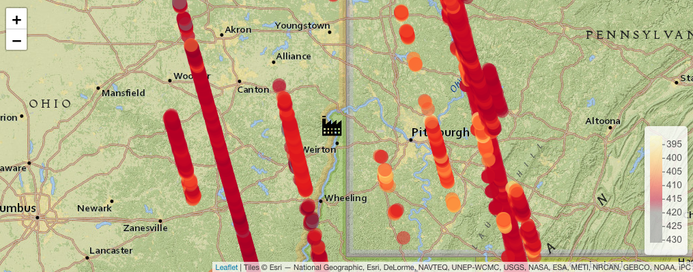

# Satellite Imaging for Climate Policy and Accountability
Project covering analysis of OCO-2 NASA data for tracking atmospheric Carbon (XCO2),
and exploring suitability for policy evaluations.


## Analysis Paper / Background
Is attached as a [pdf](Analysis.pdf).

## [Data](data/)
The data folder contains XCO2 (Atmospheric Carbon Di-Oxide) data retrieved from:

NASA's GES DISC:
Goddard Earth Sciences (GES) Data and Information Services Center (DISC) Data Center
https://disc.gsfc.nasa.gov/information?page=15

from the OCO-2 satellite, over a period ranging from 2014 and, the time of writing - May 2021.
https://disc.gsfc.nasa.gov/datasets/OCO2_L2_Lite_FP_10r/summary?keywords=OCO-2


```cat subset_OCO2_L2_Lite_FP_10r_20210531_163158.txt | tr -d '\r' | xargs -n 1 curl -LJO -n -c ~/.urs_cookies -b ~/.urs_cookies```


This was cropped at source for areas surrounding Sammis Plant 
https://www.gem.wiki/Sammis_Plant 



in Ohio, US, and lat-long regions up to 200km away, to observe XCO2 flux correlated with Plant 
shutdowns or activity. This was then processed in:

## [R Code](r_code/code.R)
with snippets included in the r_code folder.  
This code is for references purposes - running this linearly is not advised.
Be sure to replace USERNAME/URLs as appropriate, and run package.install() for required libraries.
the getDataNC4 method handles filtering logic.

Some of the graphic codes, with other usage patterns can be seen 
under [code.Rhistory](r_code/code.Rhistory). 
Relevant plots are exported to the [plots](r_code/plots/) folder.


